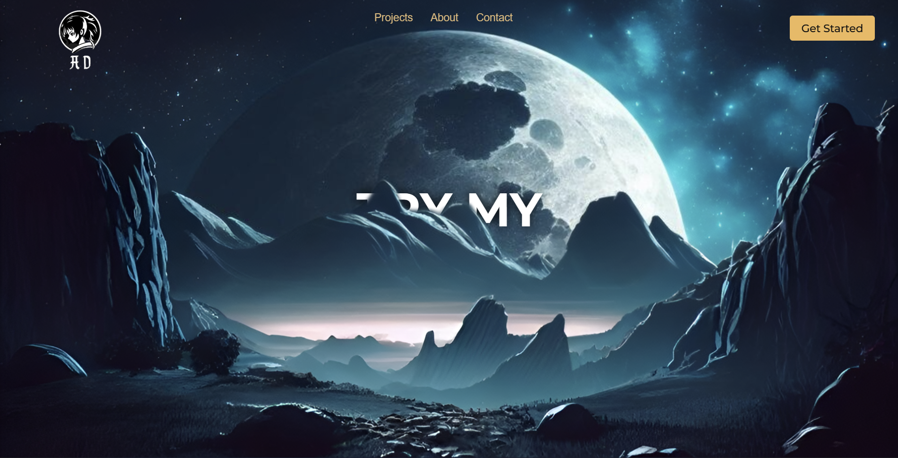
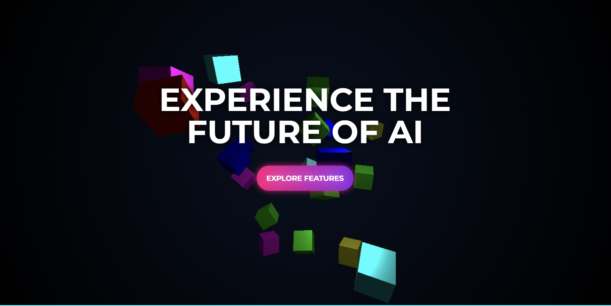
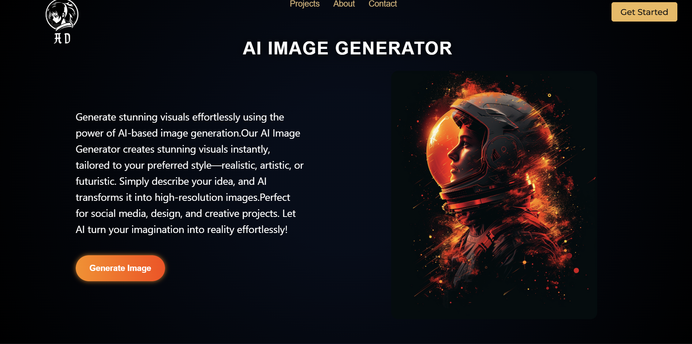
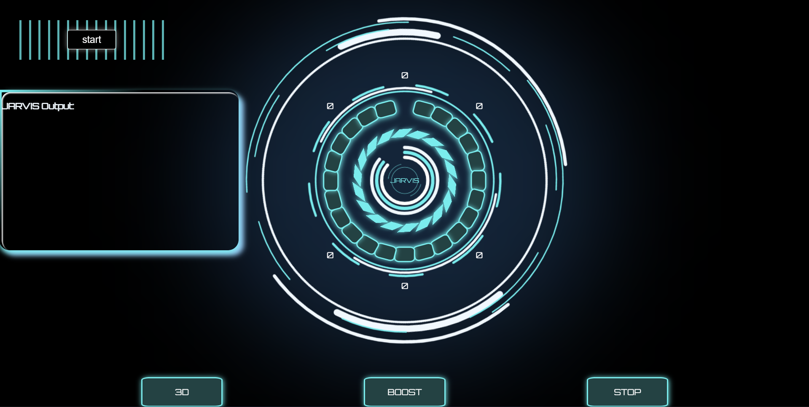
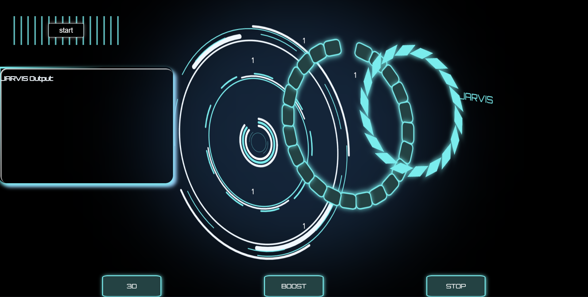

# AI Voice Assistant (LLM)

[](https://www.python.org/)
[](https://www.djangoproject.com/)

## Overview
**AI Voice Assistant** is a Advanced AI-powered voice web application with LLM capabilities that integrates AI-powered voice recognition and response capabilities.  
It allows users to interact with the application using natural voice commands and receive intelligent audio responses.  

This project demonstrates full-stack Django development along with AI integration, real-time communication using Django Channels, and secure handling of sensitive data.

---

## Demo Screenshots

Here are screenshots showcasing the AI Voice Assistant in action:

### Screenshot 1


### Screenshot 2


### Screenshot 3


### Screenshot 4


### Screenshot 5


### Screenshot 6



## Features
- **Voice Recognition:** Convert user speech into text using AI.
- **AI-Powered Responses:** Generate intelligent responses based on user queries.
- **Real-Time Interaction:** Seamless voice-based communication using Django Channels and ASGI.
- **User Authentication:** Secure login and custom user management.
- **Environment-Safe:** All sensitive keys are loaded from environment variables (`.env`).

---

## Technology Stack
- **Backend:** Python 3.11, Django 5.1, Django Channels
- **AI/ML Libraries:** OpenAI / GPT (or specify libraries used)
- **Database:** SQLite (development) — configurable for PostgreSQL/MySQL
- **Frontend:** HTML, CSS, JavaScript
- **Other:** dotenv for environment variables, SMTP for email OTP

---

## Installation & Setup

1. **Clone the repository**
```bash
git clone https://github.com/Adithyan-Defender/AI-Voice-Assistant.git
cd AI-Voice-Assistant


Create a virtual environment

python -m venv venv


Activate the virtual environment

Windows:

venv\Scripts\activate


macOS/Linux:

source venv/bin/activate


Install dependencies

pip install -r requirements.txt


Create a .env file in the django project root and add your secrets:

DJANGO_SECRET_KEY=your-secret-key
EMAIL_HOST_USER=your-email
EMAIL_HOST_PASSWORD=your-email-password
GROQ_API_KEY=your-api-key

in aivoice/aivoice/aivoice/AI/jarvis/Brain.py

API_URL = "https://api.deepinfra.com/v1/openai/chat/completions"
API_KEY = "Bearer your api_key"  # Replace with actual key

and create an django superuser to login

run this
python manage.py createsuperuser

Run migrations

python manage.py migrate


Start the development server

python manage.py runserver

install ollama if run locally


Access the app at http://127.0.0.1:8000

